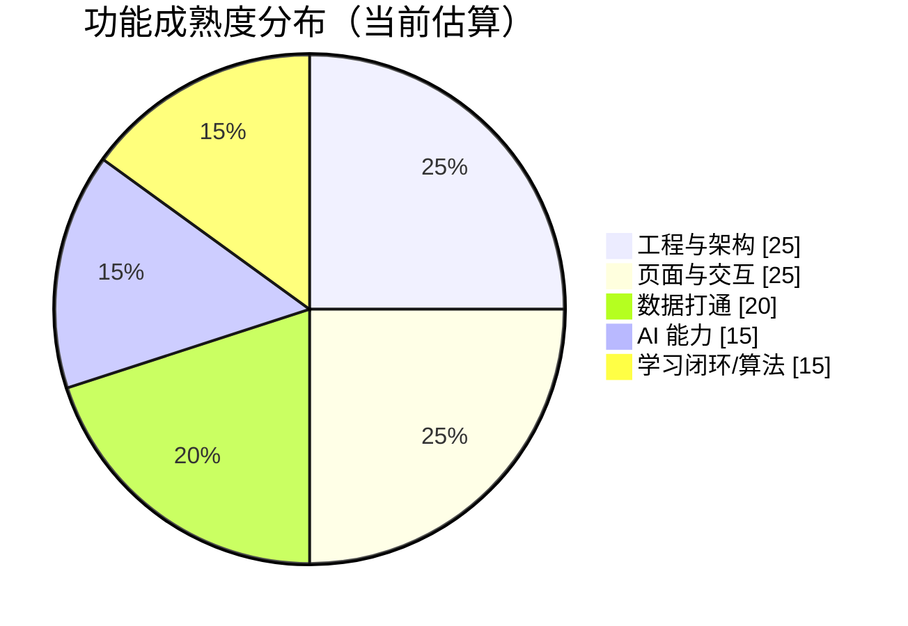

# Linswift 项目进度分析报告（代码库+文档）

> 统计时间：2026-02-24
> 结论基于：`README.md`、`DEVELOPMENT_PLAN.md`、`PRD.md`、`src/` 当前实现。

## 1. 总体结论

- **产品框架已经可运行**：React + TypeScript + Router + Tailwind + Supabase SDK 均已接入。
- **前端页面覆盖已较高**：路由层面可见 **34 个页面路由**（含设置、游戏、PDF Reader 等扩展页），明显超过 README 中“24 页”的早期描述。
- **核心差距在“业务闭环”**：大量页面已有 UI 与入口，但数据库写入、学习算法、音频/TTS/STT、内容分发等仍处于“部分完成/待打通”状态。
- **阶段判断**：项目已从“纯原型”进入“可用雏形 + 持续集成”阶段，整体可评估为 **MVP 后期（约 65%）**。

---

## 2. 进度分层评估

### 2.1 基础工程（约 90%）

已完成：
- 工程化配置（Vite、TypeScript、ESLint、PWA 构建）
- 前端主路由与鉴权路由守卫
- Supabase Client 封装与类型定义

待完善：
- 产物体积仍偏大（build 提示 chunk > 500kB）

### 2.2 页面与导航覆盖（约 85%）

已完成：
- 主学习链路页面齐全：登录/注册、学习、翻译、词库、个人中心
- 阅读、背词、听力、口语、语法/测试等模块均有页面入口
- 新增扩展：个人设置子页、词汇游戏页、PDF Reader 页

待完善：
- 若干页面仍以静态数据为主，缺少真实数据驱动

### 2.3 数据与后端打通（约 50%）

已完成：
- Supabase 数据表设计与迁移脚本
- `useProfile` / `useTranslations` / `useVocabulary` 等 Hook 已开始与数据库交互
- 认证上下文（AuthContext）已接入

待完善：
- 文档中仍列出大量“缺失功能”（翻译收藏、词库同步、阅读进度、听力成绩等）
- 很多模块还未形成“采集-计算-反馈”闭环

### 2.4 AI 与学习功能深度（约 55%）

已完成：
- README 标注多项 AI 能力“已接入”（翻译、场景对话、速记、分类等）

待完善：
- PRD/计划文档仍显示大量能力处于待接入或待落库状态
- 学习效果相关（艾宾浩斯调度、个性化推荐、统一学习档案）仍需强化

---

## 3. 模块化进度可视化

## 3.1 阶段进度（按文档 + 代码综合判断）

```mermaid
gantt
    title Linswift 阶段进度（估算）
    dateFormat  X
    axisFormat %s

    section 已完成度
    Phase 1 核心页面/主流程        :done, p1, 0, 90
    Phase 2 阅读+背词基础框架      :done, p2, 0, 80
    Phase 3 听力+口语基础框架      :active, p3, 0, 75
    Phase 4 语法+测试页面          :active, p4, 0, 70
    Phase 5 Supabase 深度集成      :active, p5, 0, 50
    Phase 6+ 词汇游戏/PDF 扩展     :active, p6, 0, 60
```

## 3.2 能力构成（功能成熟度）

## 3.3 模块看板（完成度）

| 模块 | 当前完成度（估算） | 说明 |
|---|---:|---|
| 认证与账户 | 75% | 鉴权框架已接入，细节流程与异常处理可继续补齐 |
| 学习首页/导航 | 85% | 主结构稳定，部分数据仍为 mock/静态 |
| 翻译与词库 | 65% | AI 和基础交互有，完整历史/收藏/同步还需打通 |
| 阅读器（书架-预习-阅读） | 55% | 页面齐全，PDF 内容解析与学习数据闭环待完善 |
| 听力模块 | 50% | 页面与入口有，播放器/统计/进度链路不足 |
| 口语模块 | 55% | 场景与对话入口有，评分和记录闭环待完善 |
| 测试与语法 | 60% | 页面基本齐备，结果沉淀与个性化建议待补 |
| 游戏化学习 | 45% | 已有页面基础，玩法深度和成绩体系仍初期 |

---

## 4. 当前里程碑判断

- **里程碑 M1（可演示原型）**：✅ 已达成。
- **里程碑 M2（可连续使用的 MVP）**：🚧 接近完成，关键在数据闭环与性能优化。
- **里程碑 M3（可规模化运营）**：⏳ 尚未达到，需要稳定数据模型、内容生产与学习效果验证。

---

## 5. 建议的下一阶段优先级（未来 2~4 周）

1. **先打通“高频闭环”**：翻译 → 收藏/收词 → 复习 → 统计（端到端）。
2. **压缩首屏包体**：按模块拆包（阅读、听力、口语、游戏懒加载）。
3. **统一学习记录模型**：把阅读/听力/口语/词汇测试都汇总到 study_records + 衍生统计。
4. **完善用户感知最强功能**：音频播放、TTS、词汇复习计划（艾宾浩斯）优先。
5. **建立质量基线**：为核心 Hook 与关键页面补最小自动化测试（认证、词库 CRUD、翻译存取）。

---

## 6. 一句话判断

> Linswift 目前已经具备“完整产品骨架 + 多模块入口 + 部分真实数据能力”，下一步的胜负手在于**把分散功能串成可持续学习闭环**。
